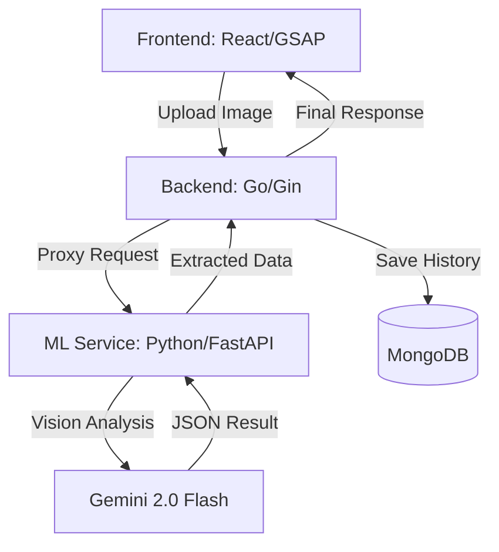

# Prescription Analyzer AI

**🔴 Live Demo:** [https://prescriptionanalyzer.vercel.app/](https://prescriptionanalyzer.vercel.app/)
A high-performance AI-powered system designed to analyze and extract information from handwritten and digital prescriptions. Utilizing **Gemini 2.0 Flash Vision**, this system achieves near-human accuracy in reading complex multi-line handwritten medical data.

---

## 🚀 System Architecture

The project is built on a high-efficiency microservices architecture, ensuring scalability and separation of concerns.



- **Frontend**: A modern, premium React interface utilizing GSAP & Framer Motion for smooth, high-end animations.
- **Backend (Orchestration)**: A high-concurrency Go API that handles authentication, database logic, and proxies data to the ML engine.
- **ML Service (Inference)**: A stateless FastAPI service dedicated to OCR and LLM-based extraction. It uses advanced image preprocessing and the Gemini Flash Vision API.
- **Database**: MongoDB for secure, persistence of prescription history and metadata.

---

## 🌟 Key Features

- **🎯 Industrial-Grade Extraction**: Precisely extracts patient demographics, doctor metadata, clinical diagnosis, and full medication tables.
- **✍️ Handwriting Intelligence**: Specifically engineered for the nuances of Indian medical handwriting (including Hindi scripts), supporting shorthand like `bd`, `od`, `TDS`, `SOS`, and symbolic dot-line frequencies.
- **🌐 Native Hindi Translation**: Built-in feature to support analyzing full Hindi prescriptions (with auto contrast enhancements) and toggling real-time translations on the frontend.
- **⚡ Stateless & Secure**: Designed for privacy with a stateless flow—images are processed and discarded immediately after extraction.
- **📊 Real-time Confidence**: Every result is accompanied by AI confidence scores and accuracy rates, ensuring clinicians can verify results transparently.

---

## 🛠️ Tech Stack

| Layer | Technologies |
| :--- | :--- |
| **Frontend** | React 18, GSAP, Framer Motion, Tailwind CSS (Design Tokens), Lucide Icons |
| **Backend** | Go (Golang), Gin Gonic, MongoDB Driver |
| **ML Engine** | Python 3.10+, FastAPI, google-genai, OpenCV, Pytesseract |
| **Model** | Gemini 2.0 Flash Vision (Primary), Cohere Command-R Plus (Secondary) |
| **Infrastructure** | Docker, Railway.app, Vercel |

---

## 📂 Project Structure

```bash
├── frontend/             # React application (Vite-based)
├── backend/              # Go API (Service orchestration)
│   ├── cmd/server/       # Entry point
│   ├── internal/         # Business logic & Handlers
├── ml-service/           # Python ML service
│   ├── app/main.py       # FastAPI entry point
│   ├── app/services/     # Extraction & OCR logic
└── ISSUES_RESOLVED.md    # Detailed technical journal
```

---

## ⚙️ Quick Setup

### 1. Requirements
- Node.js 18+
- Go 1.21+
- Python 3.10+
- MongoDB Instance

### 2. Configuration
Create a `.env` file in the root directory:
```env
# ML Service
GEMINI_API_KEY=your_gemini_key
COHERE_API_KEY=your_cohere_key

# Backend
MONGODB_URI=your_mongodb_connection_string
PORT=8080

# Frontend
VITE_API_URL=http://localhost:8080
```

### 3. Run Locally
**ML Service:**
```bash
cd ml-service
pip install -r requirements.txt
python -m uvicorn app.main:app --port 8000
```

**Backend:**
```bash
cd backend
go run cmd/server/main.go
```

**Frontend:**
```bash
cd frontend
npm install
npm run dev
```

---

## 🔮 Future Roadmap

1.  **♿ Accessibility First**: Implementation of Text-to-Speech (TTS) for automatic dosage reading.
2.  **🎨 Color Assist**: High-contrast and color-blind optimized UI themes.
3.  **🇮🇳 Expanded Regional Support**: Extending existing Hindi prescription support to other scripts like Bengali, Tamil, etc.
4.  **🏥 Safety Layer**: Real-time checking for drug-to-drug interactions (DDIs).
5.  **📱 Ecosystem Sync**: Integration with HealthStacks (Apple Health / Google Fit).

---

## 📜 License & Acknowledgments
Developed by **Sneha Das**.  
*For a detailed history of technical challenges and solutions, see [ISSUES_RESOLVED.md](./ISSUES_RESOLVED.md).*